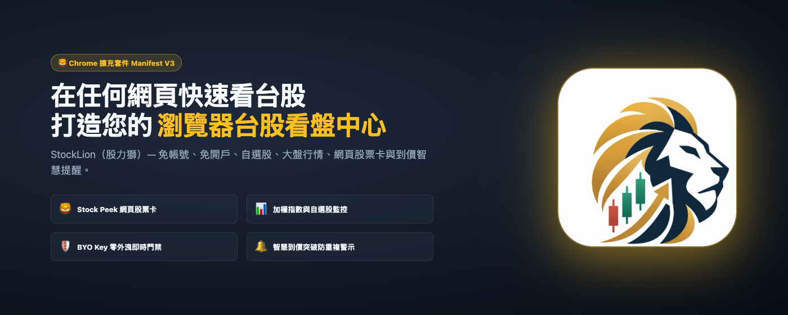
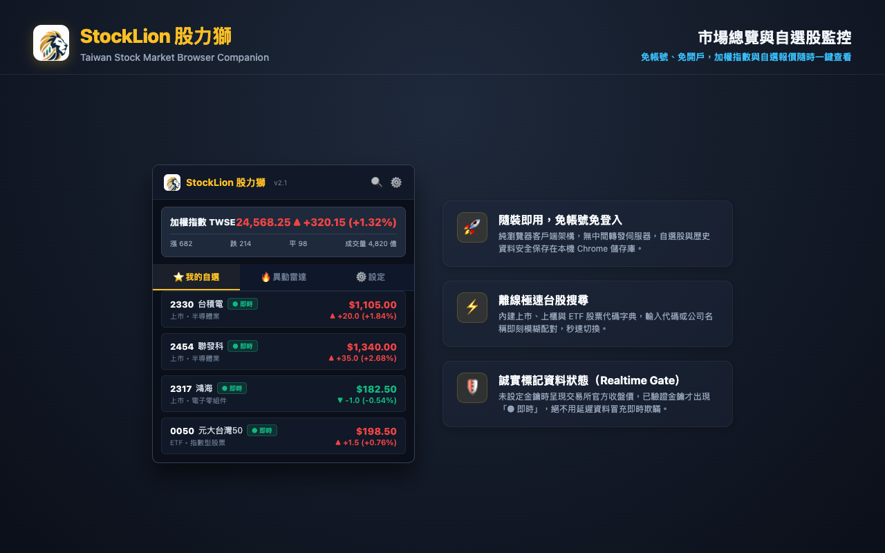
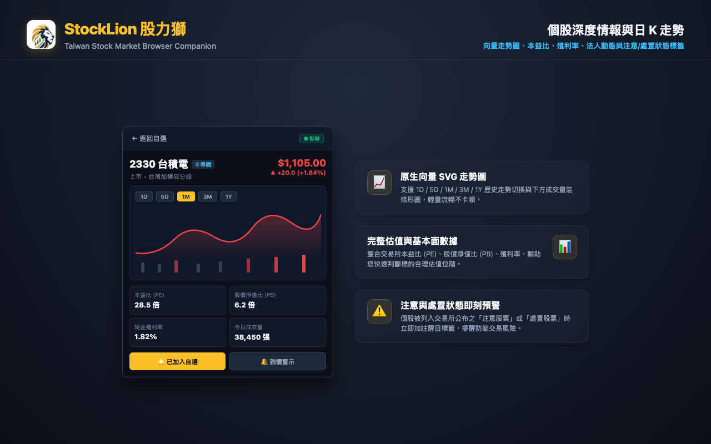
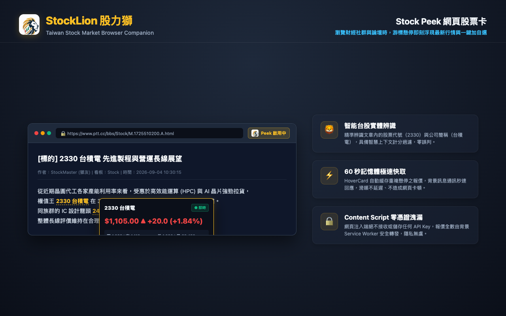
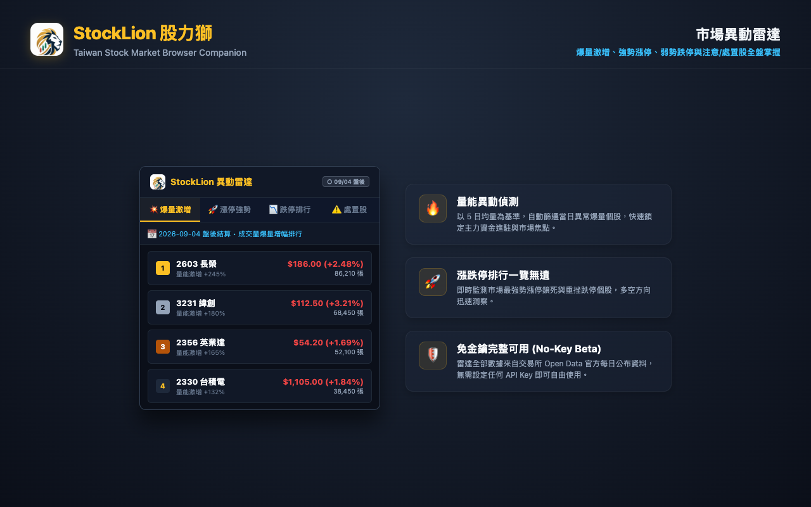
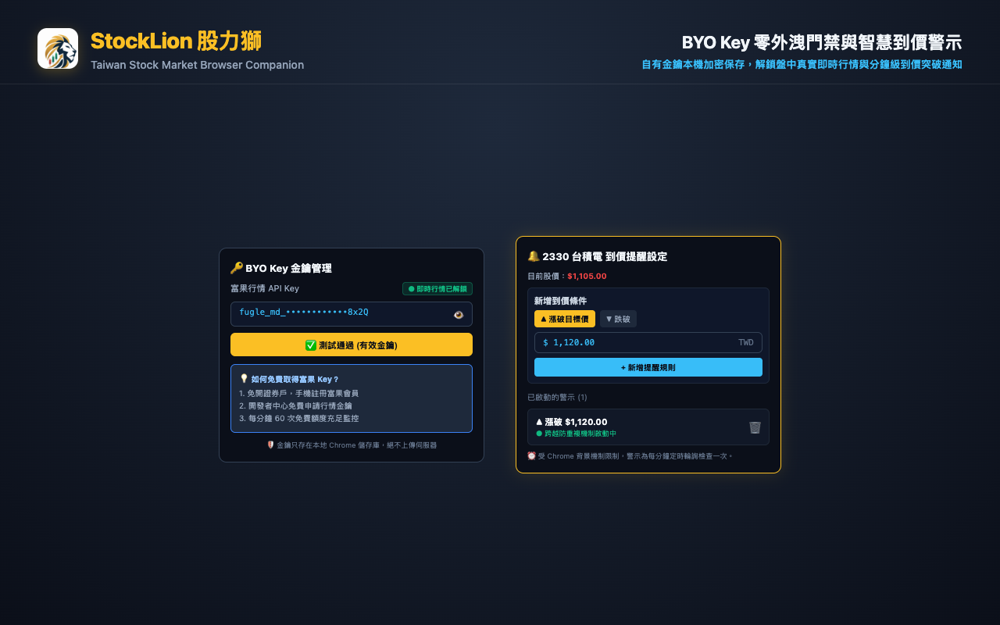

<p align="center">
  
</p>

<h1 align="center">🦁 StockLion（股力獅）</h1>

<p align="center">
  <strong>台灣股市瀏覽器必備神器 • 網頁股票卡 • 聰明看盤不分心</strong><br />
  在任何網頁隨手掌握台股報價、自選清單與市場動態，不必頻繁切換券商 App！
</p>

<p align="center">
  
  
  
  
  
  
</p>

---

## 🌟 為什麼選擇股力獅？（3 秒看懂特色）

你在瀏覽 PTT 股板、Threads、看財經新聞或研究報告時，常常看到股票代號就得切換看盤軟體查價格嗎？

**StockLion 就是為此而生！** 它是專為台股投資人量身打造的輕量瀏覽器延伸套件：

1. 🦁 **Stock Peek 網頁股票卡**：逛網頁看到「2330」或「台積電」，游標移過去立刻浮出卡片，即時報價、PE/PB 一目了然，還能一鍵加入自選！
2. ⚡ **免帳號、隨裝即用**：不需註冊帳號、不用綁定任何券商，安裝後就能直接使用大盤行情、離線代號搜尋、自選股與異動雷達。
3. 🛡️ **自帶金鑰（BYO Key）零外洩**：支援使用者填入自己的富果免費行情金鑰。**金鑰只存於您的本機瀏覽器，絕不上傳任何伺服器**。
4. 🏷️ **誠實標記，拒絕假即時**：未設定金鑰時明確標示「○ 收盤」，驗證成功後才標註「● 即時」，資訊透明絕不欺瞞。
5. 🔔 **智慧到價警示**：支援目標價突破/跌破提醒，內建「門檻跨越防重複通知」，波段價位防守最安心。

---

## 📸 功能圖解（看圖最清楚）

### 1. 📊 大盤首頁與自選股監控
隨手點開瀏覽器右上角圖示，立即查看加權指數、櫃買行情、成交量與自選股清單。支援秒速離線搜尋，輸入代碼或公司名稱立刻配對！



---

### 2. 📈 個股深度情報與日 K 走勢
點進個股即可查看原生向量日 K 走勢圖（支援 1D~1Y 與成交量能）、本益比 (PE)、淨值比 (PB)、現金殖利率與注意/處置股票警示標籤。



---

### 3. 🦁 Stock Peek 網頁股票卡（招牌功能！）
在 PTT 股板、Threads、Yahoo 股市、鉅亨網、工商時報等網站瀏覽討論時，游標懸停在股票代號或名稱上，立即浮現行情卡，還能直接點擊「⭐ 加入自選」！



---

### 4. 🔥 市場異動雷達
每日盤後自動統整市場 6 大焦點排行：爆量激增股、強勢漲停股、重挫跌停股以及主管機關公布之注意與處置股名單，免金鑰即可完整查閱。



---

### 5. 🔑 BYO Key 金鑰管理與到價警示
將自己申請的富果 API Key 貼上儲存即可解鎖盤中即時行情。還能為心儀個股設定目標價警示，價格突破門檻自動發送桌面推播！



---

## 🚀 3 步驟快速上手

### 步驟 1：安裝套件
- 下載或載入本擴充套件，瀏覽器右上角會出現金黃獅頭 🦁 圖示。

### 步驟 2：開始看盤
- 點擊圖示直接查看大盤、搜尋股票加入自選，享受無帳號的輕巧體驗。

### 步驟 3：（選用）解鎖盤中即時行情
- 若希望在台股開盤盤中看到跳動的「● 即時」報價，只需 3 分鐘免費申請富果金鑰並填入設定頁即可！

---

## 💡 如何免費取得富果行情 API Key？（3 分鐘搞定）

StockLion 在**不填寫任何 API Key** 的情況下即可正常使用大盤、搜尋、自選、個股與雷達（顯示交易所盤後資料）。若需要盤中即時連線，請依以下步驟取得官方免費金鑰：

1. **前往開發者中心**：進入 [富果行情 API 開發者文件](https://developer.fugle.tw/marketdata/document/token)。
2. **免開證券戶**：只需手機號碼或 Email 註冊富果帳號即可，**完全不需開設玉山證券戶**。
3. **領取免費金鑰**：登入後點選「行情 API 金鑰申請」，即可取得專屬 Token。
4. **享有充裕額度**：免費方案即提供 **60 次/分鐘** 請求額度，個人日常看盤非常充裕。
5. **貼回套件設定**：點擊 StockLion 內的 ⚙️ 設定分頁，貼上金鑰並點擊「測試並儲存金鑰」，驗證成功立即點亮綠燈 `● 即時行情已解鎖`！

---

## ❓ 常見問答（FAQ）

#### Q1：我一定要申請富果 Key 才能用 StockLion 嗎？
> **完全不需要！**  
> StockLion 內建支援臺灣證券交易所與櫃買中心的公開資料（Open Data）。即使不填寫任何金鑰，大盤指數、自選清單、個股基本面（PE/PB/殖利率）、日 K 走勢圖以及異動雷達全部都能直接免費使用。只有盤中想要「即時跳動報價」時才需填寫。

#### Q2：到價通知是每秒更新嗎？
> **不是，是每分鐘檢查一次（分鐘級提醒）。**  
> 為了節省您的電腦記憶體與電力，並遵循 Chrome 擴充套件標準規範，背景排程係以 `chrome.alarms` 每分鐘檢查一次，適合作為波段操作或重要支撐壓力位的到價防守提醒。

#### Q3：我的富果 API Key 放在這裡安全嗎？
> **百分之百安全！**  
> StockLion 採用「無後端 (No-Backend)」純客戶端架構，您的金鑰僅儲存在您本機電腦的 `chrome.storage.local`，絕不回傳到任何伺服器。就連瀏覽網頁時的 Content Script 也受安全隔離無法存取您的金鑰。

#### Q4：為什麼有些網頁沒有出現 Stock Peek 股票卡？
> 為了保障您的網頁瀏覽順暢與隱私安全，StockLion **絕不使用危險的 `<all_urls>` 全網域監聽**，僅在財經社群白名單（PTT Stock 板、Yahoo 股市、鉅亨網、Threads、經濟日報、工商時報等）中啟用，完全不拖慢日常網頁瀏覽體驗。

---

## 🎨 Chrome Web Store 上架素材（Store Assets）

專案已準備好符合 Chrome Web Store 最新審核規範的宣傳素材：

| 素材項目 | 規格 | 檔案路徑 | 說明 |
|---|---|---|---|
| **小宣傳圖磚** | 440 x 280 px (無透明層) | [promo-small-440x280.png](docs/screenshots/promo-small-440x280.png) | 商店搜尋結果推薦圖磚 |
| **大型宣傳橫幅** | 1400 x 560 px (無透明層) | [promo-marquee-1400x560.png](docs/screenshots/promo-marquee-1400x560.png) | 商店專題推薦輪播大橫幅 |
| **截圖 1** | 1280 x 800 px (無透明層) | [screenshot-1-market.png](docs/screenshots/screenshot-1-market.png) | 市場總覽與自選股監控 |
| **截圖 2** | 1280 x 800 px (無透明層) | [screenshot-2-detail.png](docs/screenshots/screenshot-2-detail.png) | 個股深度情報與日 K 走勢 |
| **截圖 3** | 1280 x 800 px (無透明層) | [screenshot-3-stock-peek.png](docs/screenshots/screenshot-3-stock-peek.png) | Stock Peek 網頁股票卡 |
| **截圖 4** | 1280 x 800 px (無透明層) | [screenshot-4-radar.png](docs/screenshots/screenshot-4-radar.png) | 市場異動雷達 |
| **截圖 5** | 1280 x 800 px (無透明層) | [screenshot-5-alert.png](docs/screenshots/screenshot-5-alert.png) | BYO Key 門禁與到價警示 |

---

## 🛠️ 開發與建置指令（Development）

```bash
# 1. 安裝套件依賴
pnpm install

# 2. 啟動本機開發熱重載 (Chrome MV3)
pnpm dev

# 3. 執行 TypeScript 型別檢查 (0 errors)
pnpm typecheck

# 4. 執行全套單元與整合測試 (111 tests passed)
pnpm test

# 5. 打包生產版本 (輸出至 .output/chrome-mv3)
pnpm build

# 6. 重新生成商店宣傳截圖素材
python3 scripts/generate_store_assets.py
```

---

## ⚖️ 免責聲明（Disclaimer）

> StockLion 提供之資訊僅供個人學習與資訊整理用途，不構成任何形式之投資建議、推薦或買賣邀約。金融市場瞬息萬變，資料傳輸可能受網路或來源端影響而產生延遲，實際成交價與市場資訊請務必以臺灣證券交易所、證券櫃檯買賣中心及您的往來證券商公告為準。使用者依本套件資訊所為之任何投資決策，須自行承擔全部損益風險。

---

## 📄 開源授權

本專案採用 [MIT License](LICENSE) 授權條款開源發布。
